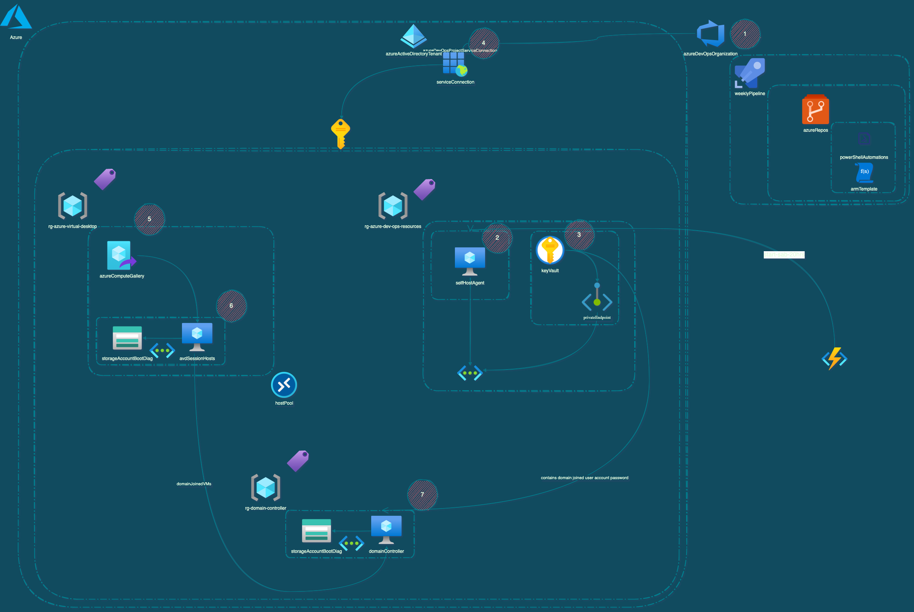

# __AZURE VIRTUAL DESKTOP - ENVIRONMENT MAINANTENCE__

This is a fork of the original source code of the AVD automation and it will be maintained by the author and community contributors.

Contents:
- [Solution Diagram](#solutionDiagram)
- [Components Description](#description-of-the-components)
    - [Azure DevOps](#azure-devops)
        - [Pipeline](#pipelines)
        - [Service Connect](#service-connect)
        - [Self Hosted Agent](#self-host-agent)
        - [Code Repository](#code-repository)
    - [Azure](#azure)
        - [AVD Host Pool](#avd-hostpool)
        - [AVD Session Host](#avd-session-hosts)
        - [Azure Compute Gallery](#azure-compute-gallery)
        - [Azure Key Vault](#azure-keyvaults)
        - [Storage Account](#storage-account)
    - [Active Directory Domain Services (ADDS)](#active-directory-domain-services)
        - [Organizational Unity](#organizational-unity)
        - [Domain Join Account](#domain-join-account)
- [Changelog](CHANGELOG.md)
- [Contributing](#Contributing)

# __<a name="solutionDiagram">Solution Diagram</a>__

The diagram below helps you to have a better understandment of how the automation works and which componentes are used on Azure and Azure DevOps.

# __<a name="descriptionOfTheComponents">Description of the Components</a>__

## __<a name="azureDevOps">Azure DevOps</a>__

### __<a name="pipeline">Pipelines</a>__
### __<a name="serviceConnect">Service Connect</a>__
### __<a name="selfHostedAgent">Self-Host Agent</a>__
### __<a name="azureRepos">Code Repository</a>__

## __<a name="azure">Azure</a>__

### __<a name="avdHostPool">AVD HostPool</a>__
### __<a name="avdSessionHosts">AVD Session Hosts</a>__
### __<a name="azureComputeGallery">Azure Compute Gallery</a>__
### __<a name="azureKeyVault">Azure KeyVaults</a>__
### __<a name="storageAccount">Storage Account</a>__

## __<a name="activeDirectoryDomainServices">Active Directory Domain Services</a>__

### __<a name="organizationalUnity">Organizational Unity</a>__
### __<a name="domainJoinAccount">Domain Join Account</a>__

# __<a name="contributing">Contributing</a>__

This project welcomes contributions and suggestions. Most contributions require you to agree to a Contributor License Agreement (CLA) declaring that you have the right to, and actually do, grant us the rights to use your contribution. For details, visit https://cla.microsoft.com.